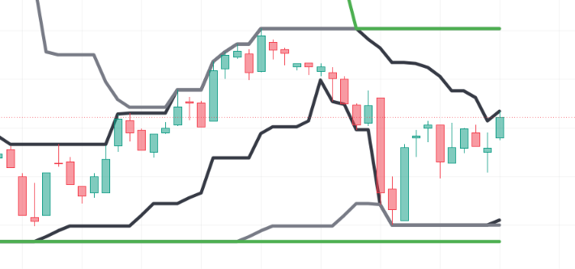

# Pine-Script-Triple-Price-Channel-Indicator
Indicator based on multi-tiered Donchian Price Channels utilizing classical 9, 26, and 52 lookback periods. Plots nested short-term, intermediate-term, and long-term dynamic support and resistance boundary bands for any asset on TradingView.
--
## Chart Preview

--
## Motivation & Problem
- **Isolated Range Blindspots & Breakout Ambiguity**: Single-period price channels fail to convey broader structural context, leaving traders unable to distinguish between minor micro-range fakeouts and genuine macro trend breakouts.
- **The Core Goal**: To engineer a clean, multi-layered visual framework that nests three distinct Price Channels (short-term 9, intermediate 26, and macro 52)—providing traders with immediate hierarchical support, resistance, and volatility expansion boundaries.
--
## Strategy Logic & Architecture
- This indicator maps multi-timeframe price extremes by utilizing a **rule-based, multi-tiered channel architecture**:
### Core Components:
1. **Hierarchical 3-Tier Price Channels (Donchian Structure)**:
  - **PC 1 (Short-Term - Period 9)**: Computes the 9-bar highest high and lowest low ('ta.highest' / 'ta.lowest'), capturing immediate micro-swing boundaries and intraday breakout volatility.
  - **PC 2 (Intermediate-Term - Period 26)**: Computes the 26-bar highest high and lowest low, representing intermediate equilibrium and medium-term structural support/resistance.
  - **PC 3 (Long-Term - Period 52)**: Computes the 52-bar highest high and lowest low, marking major macro trend boundaries, range boundaries, and macro breakout triggers.
2. **Equilibrium Midpoint Calculation**:
  - Automatically calculates the central median line for each tier ('(highest + lowest) / 2') to identify fair-value equilibrium levels within each corresponding cycle.
3. **Visual Nesting & Execution Guidance**:
  - Plots distinct, high-visibility boundary lines (linewidth 4) with independent color palettes (Black for short-term, Gray for intermediate, Green for macro).
  - Enables traders to identify volatility squeezes when all three channels converge, and strong directional expansion when price breaks out of the outer 52-period envelope while riding the inner 9-period channel.
--
## Configurable Parameters
Users can adjust the following parameters inside TradingView's settings panel:
- **PC 1 Settings (Short-Term)**: Default - Length 9, Offset 0, Color Black. Lookback period and style for the fast price channel.
- **PC 2 Settings (Intermediate-Term)**: Default - Length 26, Offset 0, Color Gray. Lookback period and style for the intermediate price channel.
- **PC 3 Settings (Long-Term)**: Default - Length 52, Offset 0, Color Green. Lookback period and style for the macro price channel.
--
## How to Install & Use in TradingView
1. Open any chart (e.g., `BTC/USDT`) on **[TradingView](https://www.tradingview.com/)**.
2. Open the **`Pine Editor`** console at the bottom of the page.
3. Open `Tripple-PC.txt` (or your Pine Script file), copy the source code, and paste it into the editor.
4. Click **`Save`** and then click **`Add to Chart`**.
5. Click the gear icon (`Settings`) on the indicator to customize lookback periods, offsets, and line colors as needed.
--
## Key Learnings & Engineering Reflections
1. **Cycle-Harmonized Donchian Envelopes (9, 26, 52)**
  - I learned that adopting classical Ichimoku numerical cycles (9, 26, 52) within Donchian Price Channels creates a harmonious multi-timeframe perspective on a single chart without requiring external 'request.security()' calls.
2. **Nested Range Compression vs. Expansion Dynamics**
  - I learned that monitoring the spread between the 9-period channel and the 52-period channel provides an immediate visual gauge of market volatility—compression signals an impending explosive breakout, while wide separation signals mature, trend-extended conditions.
3. **Dynamic Support, Resistance & Trailing Stop Baselines**
  - I learned that multi-layered price channels serve as non-lagging, objective structural reference points, making the 9-period low/high ideal for tight trailing stops and the 26/52-period lines ideal for structural trend-invalidation levels.
